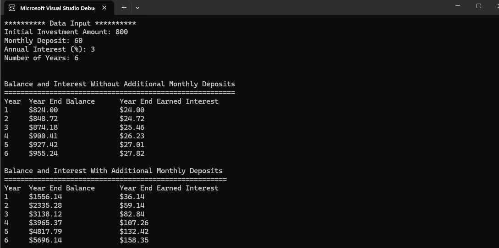

# Cplusplus-Airgead-Banking-App
C++ console application that simulates compound interest and compares investment growth with and without monthly deposits.


# 💰 Airgead Banking App


## 📸 Program Output




## 📌 Overview
The **Airgead Banking App** is a console-based C++ application that simulates investment growth using compound interest. It compares how an investment grows over time with and without monthly deposits.

This project demonstrates object-oriented programming, financial calculations, and clean code structure.

## 🚀 Features
- Calculates compound interest over time  
- Compares investment growth with and without monthly deposits  
- Displays year-by-year balance and interest earned  
- Uses clean, formatted table output  
- Built using object-oriented programming (OOP)  

## 🛠️ Technologies Used
- C++
- Object-Oriented Programming (OOP)
- Standard Library (`iostream`, `iomanip`)
- Visual Studio

## 📂 Project Structure
AirgeadBankingProject.cpp # Main entry point
InvestmentCalculator.h # Class declaration
InvestmentCalculator.cpp # Program logic


## ⚙️ How to Run


## ⚙️ How to Run

### Option 1: Visual Studio
1. Open the `.sln` file  
2. Click **Build → Rebuild Solution**  
3. Press **Ctrl + F5**

### Option 2: Terminal (g++)
```bash
g++ AirgeadBankingProject.cpp InvestmentCalculator.cpp -o airgead
./airgead


### 📊 Example Output
********** Data Input **********
Initial Investment Amount: 800
Monthly Deposit: 60
Annual Interest (%): 3
Number of Years: 6

Balance and Interest Without Additional Monthly Deposits
========================================================
Year  Year End Balance    Year End Earned Interest
1     $824.00             $24.00
2     $848.72             $24.72
3     $874.18             $25.46
4     $900.41             $26.23
5     $927.42             $27.01
6     $955.24             $27.82

Balance and Interest With Additional Monthly Deposits
======================================================
Year  Year End Balance    Year End Earned Interest
1     $1556.14            $36.14
2     $2335.28            $59.14
3     $3138.12            $82.84
4     $3965.37            $107.26
5     $4817.79            $132.42
6     $5696.14            $158.35


## 📸 Program Output


🎯 Learning Outcomes
Implemented compound interest calculations
Practiced loops and function design
Improved output formatting and readability
Applied modular programming using C++

👩‍💻 Author
Rosalie Reblora (Rose)
Bachelor of Science in Computer Science


## 📸 Program Output


